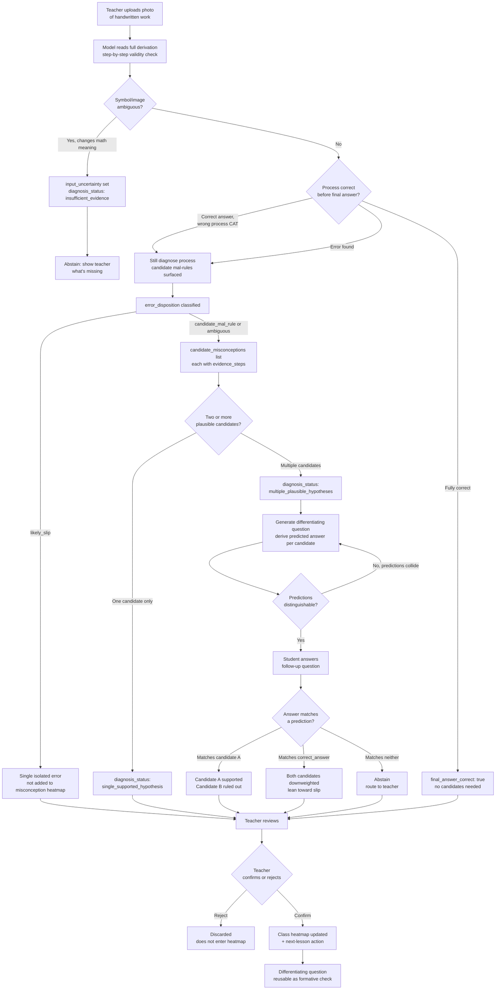

# Error Archaeologist — Briefing Draft

> Source: `docs/proposals/01-error-archaeologist.en.md` (v7 English translation). This is a pitch/briefing draft, not the full proposal — see the source doc for citations, full data, and risk sections.

## Project Intro

**Error Archaeologist** diagnoses *why* a student got a math problem wrong, not just *that* it's wrong. The same wrong answer — say, expanding `-3(x-2)` as `-3x-6` — can come from a sign error, a distribution misconception, a careless slip, or a transcription mistake, and each needs a different teacher response. Screening tools already flag who's behind, and tutoring already exists as remediation, but nothing scales the diagnosis layer between them.

Instead of an AI verdict, the system proposes falsifiable candidate hypotheses, anchors each one to the exact step in the student's handwriting where the evidence lives, then generates a differentiating question chosen so each hypothesis predicts a different answer. The student's next response — not the AI's confidence score — is what confirms or rules out the diagnosis. A teacher reviews and confirms before anything reaches a class-level heatmap or a student's practice queue.

## Pipeline Flowchart

## Slide-by-Slide Plan

Deck target: 10-12 slides, mapped to the 3-minute demo script in the source proposal §11. Format below: **Purpose / Key content / Visual / Talking point / Timing.**

---

### Slide 1 — Title / Hook

- **Purpose**: Open with the core insight before naming the product.
- **Key content**: Two pieces of handwritten homework, same wrong answer, different underlying reasoning. Optional third card: correct final answer, wrong process (Correct Answer Trap).
- **Visual**: Side-by-side photos of the two (or three) handwritten samples, wrong steps circled, no AI output shown yet.
- **Talking point**: "Same wrong answer. Completely different reason. A teacher can't tell which — and neither can most grading tools."
- **Timing**: 0:00-0:20 (demo hook)

### Slide 2 — The Problem

- **Purpose**: State the diagnosis gap and its scale.
- **Key content**: Screening (who's behind) and remediation (tutoring/course placement) are both scalable; diagnosis (why) is not. NAEP: 39% below Basic in 8th-grade math. HDT tutoring reaches only ~1-2% of eligible students even in strong programs, at $1,200-$2,000/student/year.
- **Visual**: Three-stage funnel — Screening (scaled) -> Diagnosis (gap) -> Remediation (scaled) — with the middle stage highlighted.
- **Talking point**: "Both ends of this pipeline already scale. The middle — figuring out why — still happens only in a tutor's head."
- **Timing**: n/a (context slide, before demo timer starts)

### Slide 3 — Why Not Existing Tools

- **Purpose**: Justify why this needs an LLM, not another item bank.
- **Key content**: Three prior generations (human tutoring, MC diagnostic item banks like DAAS, cognitive diagnosis models/ITS) all require either huge labor cost or pre-authored distractor items — none read free-form handwritten derivations or generate a discriminating follow-up on the fly.
- **Visual**: Comparison table (reuse source §3 table, condensed to 3 rows: Human / Item-bank / Traditional ML vs. This product).
- **Talking point**: "Every prior approach needs the misconception pre-anticipated. We read what the student actually wrote, then anticipate on the fly."
- **Timing**: n/a (context slide)

### Slide 4 — Solution Walkthrough: Structured Diagnosis

- **Purpose**: Show what the model actually outputs, and that it's a hypothesis, not a verdict.
- **Key content**: Fixed JSON schema — `candidate_misconceptions[]`, `evidence_steps`, `error_disposition`, `diagnosis_status`. No numeric confidence score anywhere.
- **Visual**: Annotated JSON snippet (trimmed from source §4) with arrows pointing from `evidence_steps` to the highlighted step in the photo.
- **Talking point**: "It never says 'the student's error is X.' It says 'here are the candidates, here's the exact step that supports each one.'"
- **Timing**: 0:50-1:00 (demo: candidates + evidence highlighted)

### Slide 5 — Solution Walkthrough: The Differentiating Experiment

- **Purpose**: Show the core innovation — a generated question designed to discriminate between hypotheses.
- **Key content**: Model derives a predicted answer per candidate before generating the question; if two candidates would predict the same answer, it regenerates; if it can't discriminate, it abstains.
- **Visual**: Split screen — "If cause A -> predicted answer X" / "If cause B -> predicted answer Y" — next to the generated question.
- **Talking point**: "This isn't 'one more practice problem.' It's an experiment designed so the student's own next answer proves which hypothesis is right."
- **Timing**: 1:20-1:50 (demo: differentiating question + predictions)

### Slide 6 — Live Demo: Convergence and Teacher Confirmation

- **Purpose**: Close the loop from prediction to confirmed diagnosis to classroom action.
- **Key content**: Student answer matches one prediction -> candidate supported, other ruled out -> teacher one-click confirm -> class heatmap + "teach this for 10 minutes next period."
- **Visual**: Live screen recording or click-through of the actual demo UI.
- **Talking point**: "The student's answer does the discriminating. The teacher just confirms and gets a next step, not a data dump."
- **Timing**: 1:50-2:15 (demo: student answer -> convergence -> teacher confirms)

### Slide 7 — Safety: Abstain, Slip, and the Correct Answer Trap

- **Purpose**: Preempt the "AI hallucinated a diagnosis" objection before a judge raises it.
- **Key content**: Ambiguous input -> forced abstain, no guessing. Isolated single-step error -> `likely_slip`, does not enter misconception heatmap. Correct final answer with wrong process still gets diagnosed (CAT).
- **Visual**: Three small before/after cards: blurry image -> abstain message; single slip -> "not flagged as misconception"; correct-answer-wrong-process -> candidates still surfaced.
- **Talking point**: "A confident wrong diagnosis is worse than no diagnosis. We built abstain in from day one, not bolted on after a failure."
- **Timing**: 2:40-2:55 (demo: holdout/abstain/CAT/slip cases shown honestly)

### Slide 8 — Evidence and Eval Results

- **Purpose**: Show the claim of accuracy is backed by a real (if small) blind test, not cherry-picked demo samples.
- **Key content**: 30-36 sample blind test, independently annotated and sealed, holdout blind-scored by an external teacher; repeatable eval harness reporting macro-F1, evidence-step accuracy, abstain accuracy, CAT recall. Even partial accuracy is shown honestly.
- **Visual**: Simple bar chart of eval categories with real numbers once available (placeholder until Day 7-8 results land); table of blind-test category composition.
- **Talking point**: "We're not showing you our best five examples. We're showing you a sealed test set, including where we're wrong."
- **Timing**: n/a (post-demo, before business section)

### Slide 9 — Who Pays, and Why It's Defensible (or Isn't Yet)

- **Purpose**: Address commercial viability and moat honestly.
- **Key content**: Three roles — User (teacher/student, doesn't pay), Payer (district/state, hypothesis pending interview validation), Incumbent (tutoring/publishers as allies, diagnostic-assessment vendors as headwind). No built-in moat after 8 days; defensibility is a strategy (confirmation-data flywheel, encoded taxonomy, workflow position between screening and remediation), not an existing asset.
- **Visual**: Three-role diagram (User / Payer / Incumbent) plus a small "moat roadmap" arrow showing data flywheel accumulating over time.
- **Talking point**: "We're not claiming a moat today. We're claiming a position — diagnosis, between screening and remediation — and a flywheel that starts filling the day this ships."
- **Timing**: n/a (business section)

### Slide 10 — What's Next

- **Purpose**: Roadmap beyond the 8-day MVP, scoped honestly as roadmap.
- **Key content**: Expand taxonomy beyond one algebra unit; template-then-generative practice problems; LMS/LTI/SSO integration; cross-domain reuse of the same hypothesis-evidence-experiment framework (code-review misconceptions, language-transfer errors, clinical reasoning).
- **Visual**: Horizon roadmap (Now / Next / Later) with the MVP's actual deliverables clearly separated from roadmap items.
- **Talking point**: "The framework doesn't care that it's math. Swap the taxonomy, swap the domain."
- **Timing**: n/a (closing section)

### Slide 11 — Close / Ask

- **Purpose**: End on the product's stance, and state what's being asked of judges.
- **Key content**: Recap one-liner. Public demo URL, judges can try it themselves live. Ask: try uploading your own sample, look at the abstain path.
- **Visual**: One-liner restated large, demo URL and QR code.
- **Talking point**: "The AI doesn't guess what's in a student's head. It proposes, it tests, and the student's own next answer decides. Try it yourself."
- **Timing**: n/a (close, judge interaction begins)

---

**Timing check**: Slides tagged with timestamps (1, 4, 5, 6, 7) sum to the 3-minute demo script (0:00-2:55) from source §11; untagged slides (2, 3, 8, 9, 10, 11) are context/business slides delivered outside the timed demo window, consistent with source §11's structure of a scripted demo core plus surrounding narrative.
